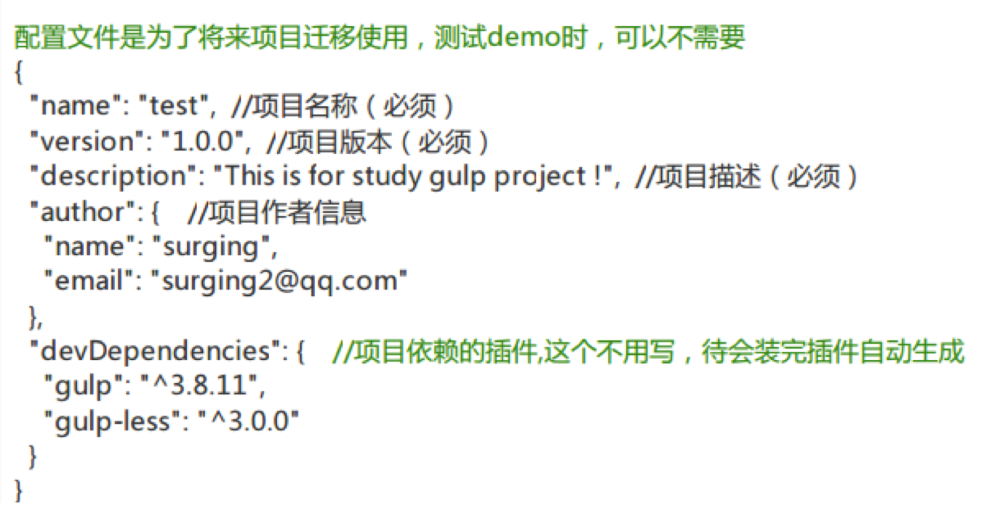

## Gulp

### gulp简介

#### 什么是gulp /grunt

> 前端开发过程中基于流的自动化构建工具

```
基于node的自动化构建利器
相关网站：gulpjs.com     gulpjs.com.cn
```

#### Gulp能做什么

```
自动压缩js文件
自动压缩css文件
自动合并文件
自动编译sass/less
自动压缩图片
自动刷新浏览器(本地服务器)
```

**实现的是资源优化，开发效率的提高**

#### 安装gulp

```
安装nodejs环境（gulp本身是node的一个模块）
```

```
Gulp是基于nodeJs环境的，因此需要先安装nodejs
下载nodeJs安装之后检测，命令行中输入node –v
如果网络不好，可以选择淘宝镜像源（npmcnpm）

nrm: (npm registry manager )是npm的镜像源管理工具，有时候国外资源太慢，使用这个就可以快速地在 npm 源间切换

在命令行执行命令，npm install -g nrm，全局安装nrm

nrm ls   /  nrm use 来查看和切换源

删除指定的源
	执行命令nrm del <registry>删除对应的源。
测试响应的时间
	nrm test npm
```

> 1. npm install -g gulp   
> 2. gulp -v 版本检测
> 3.  -g 全局安装  --save 安装到项目依赖  --save-dev 安装到开发依赖中

####  生成配置文件



> 后期可以通过npm i 来安装配置文件中的依赖模块

### gulp工作

##### 创建gulpfile.js文件，作为初始化运行文件

```js
1. 引入gulp模块

var  gulp= require("gulp");

gulp.task("hello",function(){
      console.log("hello");
});

// 默认任务
gulp.task("default",["hello"],function(){
        console.log("javascript")
});

回到命令行，执行任务
```

```js
// 拷贝文件
gulp.task('copyIndex',function(){
	return  gulp.src(‘index.html’)
           .pipe(gulp.dest(‘dist’));
           .pipe(connect.reload());
	});

gulp.task('images',function(){
   return  gulp.src('images/*.jpg')  // *.{jpg,png}  or **/* 任意文件或文件夹
   .pipe(gulp.dest('dist/imgs'));  // 
}) 

```

```js
// 拷贝多文件
gulp.task('data',function(){
         return gulp.src(['xml/*.xml', 'json/*.json']) 
        .pipe(gulp.dest('dist/data'));
})	
// 排除某个文件
	    gulp.task(‘data’,function(){
        return gulp.src([‘xml/*.xml’, ’json/*.json’,’!json/secret.json’]) 
       .pipe(gulp.dest(‘dist/data’));
    }) 

```

```js
// 多任务组合
gulp.task('build',['copyIndex','images','data'],function(){
	    console.log(“编译成功”)
});
// 监视任务
gulp.task(‘watch’,function(){
	    gulp.watch(‘index.html’,[‘copyIndex’]);
      gulp.watch(‘images/**/*.{jpg,png}’,[‘images’]);
     	gulp.watch([‘xml/*.xml’,’json/*.json’,’
                           !json/secret.json’],[‘data’])
});

```


### gulp插件

#### 编译scss/less

```js
在项目文件夹中 输入
npm install gulp-sass  --save-dev

var sass =require(‘gulp-sass’);引入文件
gulp,.task(‘sass’,function(){
   return gulp.src('stylesheet/*.sass')
  .pipe(sass())
 .pipe(dest(‘dist/css’));
     });
     
// Less编译同理
```

#### 本地服务器插件

```js
npm install gulp-connect –save-dev

var connect = require(‘gulp-connect’);

gulp.task(‘server’,function(){
connect.server({
	     root:’dist’，//设置一个本地服务器跟目录
      livereload:true  //这是实时刷新为真
 })
})；
最后可以创建一个默认任务  执行server  和watch（里面可以有多个任务)
```

#### 合并文件

```js
npm install gulp-concat  --save-dev

var  concat = require(‘gulp-concat’);引入文件
gulp.task(‘scripts’,function(){
   return gulp.src([‘javascript/login.js’,’javascript/index.js’])
  .pipe(concat(‘vendor.js’))
 .pipe(dest(‘dist/js’));
     });

```

#### 压缩js文件

```
npm install gulp-uglify  --save-dev
Var  uglify=require(‘gulp-uglify’);引入文件
gulp.task(‘scripts’,function(){
   return gulp.src([‘javascript/login.js’,’javascript/index.js’])
  .pipe(concat(‘vendor.js’))
.pipe(dest(‘dist/js’))
  .pipe(uglify())
.pipe(rename(‘vendor.min.js’))
 .pipe(dest(‘dist/js’));
     });
如果需要保留两个拷贝文件    需要安装一个rename插件
var rename=require(‘gulp-rename’);
```

#### 压缩css文件

```
npm install gulp-minify-css  --save-dev

var  minifyCss=require(‘gulp-minify-css’);引入文件
gulp,.task(‘sass’,function(){
   return gulp.src(‘stylesheet/*.sass’)
  .pipe(sass())
.pipe(dest(‘dist/css’))
.pipe(minifyCss())
.pipe(rename(‘index.min.css’))
 .pipe(dest(‘dist/css’));
     });
gulp-minify-html 压缩html插件
```

#### 压缩图片

```
压缩图片
在项目文件夹中 输入
npm install gulp-imagemin  --save-dev

Var  imagemin=require(‘gulp-imagemin’);引入文件

gulp.task(‘images’,function(){
   return  gulp.src(‘images/*.jpg’)    //  *.{jpg,png}
		    .pipe(imagemin());
   .pipe(gulp.dest(‘dist/imgs’));    // **/* 任意文件或文件夹
}) 
```


